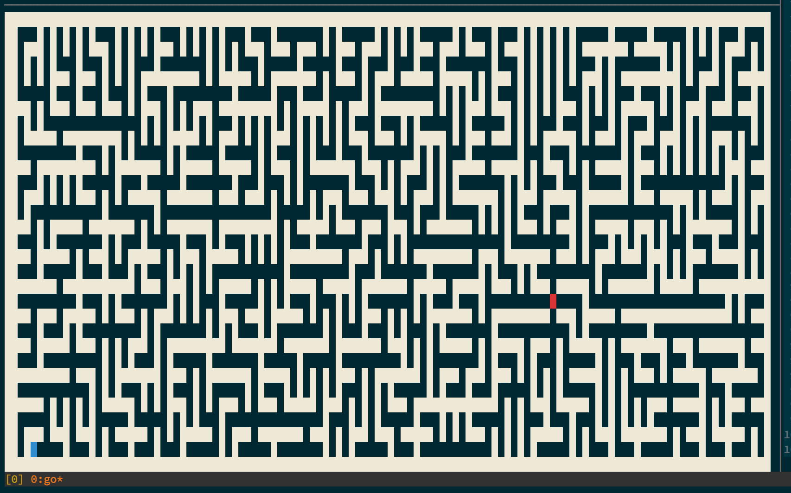
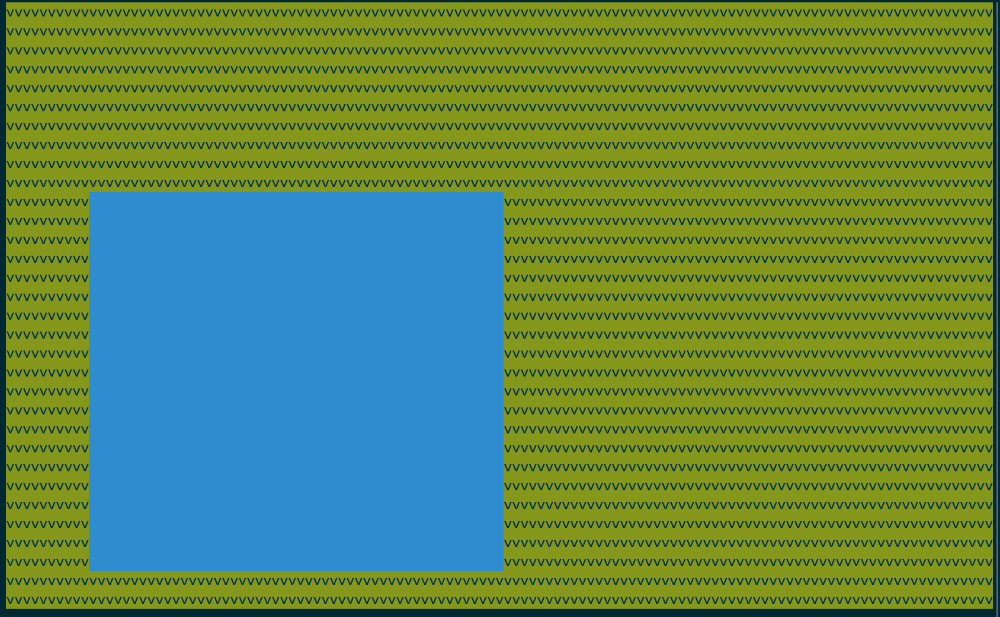
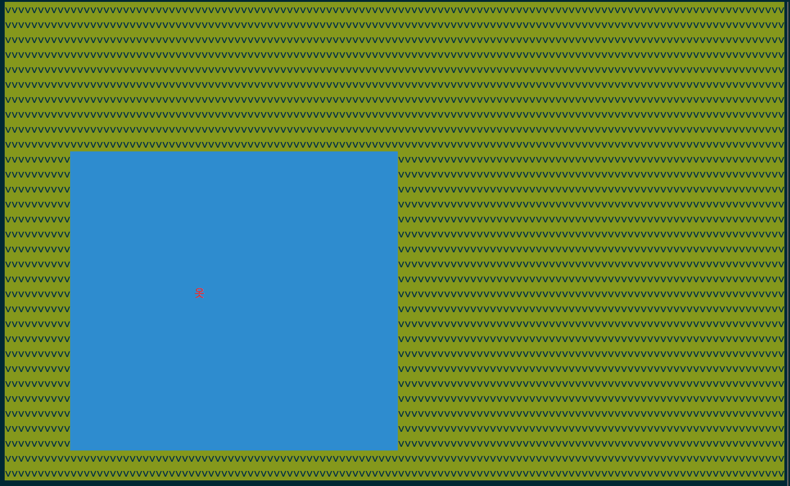
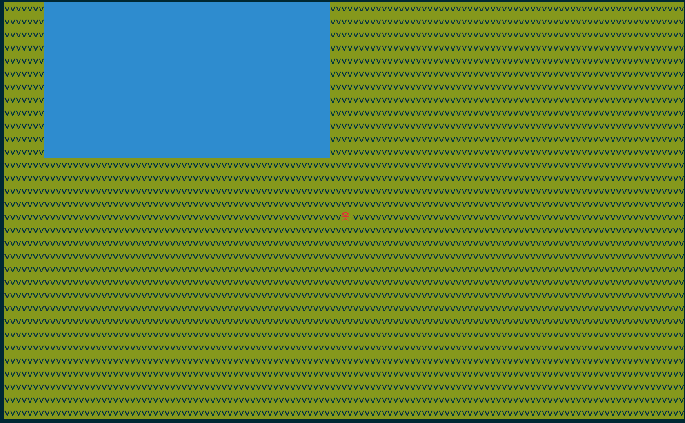

## Termloop

[](https://gitter.im/JoelOtter/termloop?utm_source=badge&utm_medium=badge&utm_campaign=pr-badge&utm_content=badge) [](http://godoc.org/github.com/JoelOtter/termloop)



Termloop is a pure Go game engine for the terminal, built on top of the excellent [Termbox](https://github.com/nsf/termbox-go). It provides a simple render loop for building games in the terminal, and is focused on making terminal game development as easy and as fun as possible.

Termloop is still under active development so changes may be breaking. I add any breaking changes to the [Changelog](https://github.com/JoelOtter/termloop/wiki/Changelog) - hopefully at this stage there shouldn't be too many. Pull requests and issues are *very* welcome, and do feel free to ask any questions you might have on the Gitter. I hope you enjoy using Termloop; I've had a blast making it.

## Installing
Install and update with `go get -u github.com/JoelOtter/termloop`

## Features

- Keyboard and mouse input
- Collision detection
- Render timers
- Level offsets to simulate 'camera' movement
- Debug logging
- Built-in entity types such as:
 - Framerate counters
 - Rectangles
 - Text
- Loading entities from ASCII art
- Loading colour maps from images
- Loading level maps from JSON
- Optional 'pixel mode' - draw two 'pixels' to a terminal character, doubling screen height at the expense of being able to render text.
- Pure Go - easy portability of compiled games, and cross-compilation built right in.

*To see what's on the roadmap, have a look at the [issue tracker](https://github.com/JoelOtter/termloop/issues).*

## termloop/extra

The Termloop extras are a collection of types and functions, the use of which will not result in a fully portable binary - that is, they have some external dependencies. However, if you're willing to require these dependencies in your project, they should integrate quite nicely with the rest of Termloop. Some of the included examples use these extras.

- Audio playback 
 - audio.go
 - Requirements: PortAudio and libsndfile

## Cool stuff built with Termloop
 
- [Included examples](https://github.com/JoelOtter/termloop/tree/master/_examples) (@JoelOtter)
- [Number Crusher](https://github.com/aquilax/number_crusher) (@aquilax)
- [Go Tapper](https://github.com/swapagarwal/gotapper) (@swapagarwal)
- [Frame Assault](https://github.com/Ariemeth/frame_assault) (@Ariemeth)
- [Minesweeper](https://github.com/ryanbaer/minesweeper-go) (@ryanbaer)
- [Termtank](https://github.com/TerrySolar/termtank) (@TerrySolar)
- [Snake](https://github.com/mattkelly/snake-go) (@mattkelly)
- [Go Man's Sky](https://rawktron.itch.io/go-mans-sky) (@rawktron)
- [conwaygo](https://github.com/buckley-w-david/conwaygo) (@buckley-w-david)
- [Doric (a Columns clone)](https://github.com/svera/doric) (@svera)
- [Terminal-based Snake](https://github.com/tristangoossens/snake-go) (@tristangoossens)
- [Sokoban](https://github.com/tristangoossens/sokoban-go) (@tristangoossens)
- [Gopher Typer](https://github.com/ScottBrooks/gopher_typer) (@scottbrooksca)
- [Tetris](https://bitbucket.org/cam73/tetris) (@cam73)
- [Gorched](https://github.com/zladovan/gorched) (@zladovan)

_Feel free to add yours with a pull request!_

## Tutorial
 
> More full documentation will be added to the Wiki soon. In the meantime, check out this tutorial, the [GoDoc](http://godoc.org/github.com/JoelOtter/termloop), or the [included examples](https://github.com/JoelOtter/termloop/tree/master/_examples). If you get stuck during this tutorial, worry not, the full source is [here](https://github.com/JoelOtter/termloop/blob/master/_examples/tutorial.go).

Creating a blank Termloop game is as simple as:

```go
package main

import tl "github.com/JoelOtter/termloop"

func main() {
	game := tl.NewGame()
	game.Start()
}
```

We can press Ctrl+C to exit. It's just a blank screen - let's make it a little more interesting.

Let's make a green background, because grass is really nice to run around on. We create a new level like so:

```go
level := tl.NewBaseLevel(tl.Cell{
	Bg: tl.ColorGreen,
	Fg: tl.ColorBlack,
	Ch: 'v',
})
```

Cell is a struct that represents one cell on the terminal. We can set its background and foreground colours, and the character that is displayed. Creating a [BaseLevel](http://godoc.org/github.com/JoelOtter/termloop#BaseLevel) in this way will fill the level with this Cell.

Let's make a nice pretty lake, too. We'll use a [Rectangle](http://godoc.org/github.com/JoelOtter/termloop#Rectangle) for this. We'll put the lake at position (10, 10), with width 50 and height 20. All measurements are in terminal characters! The last argument is the colour of the Rectangle.

```go
level.AddEntity(tl.NewRectangle(10, 10, 50, 20, tl.ColorBlue))
```

We don't need to use a Level - we can add entities directly to the [Screen](http://godoc.org/github.com/JoelOtter/termloop#Screen)! This is great for building a HUD, or a very simple app. However, if we want camera scrolling or collision detection, we're going to need to use a Level.

Putting together what we have so far:

```go
package main

import tl "github.com/JoelOtter/termloop"

func main() {
	game := tl.NewGame()
	level := tl.NewBaseLevel(tl.Cell{
		Bg: tl.ColorGreen,
		Fg: tl.ColorBlack,
		Ch: 'v',
	})
	level.AddEntity(tl.NewRectangle(10, 10, 50, 20, tl.ColorBlue))
	game.Screen().SetLevel(level)
	game.Start()
}
```

When we run it with `go run tutorial.go`, it looks like this:



Pretty! Ish. OK, let's create a character that can walk around the environment. We're going to use object composition here - we'll create a new struct type, which extends an [Entity](http://godoc.org/github.com/JoelOtter/termloop#Entity).

To have Termloop draw our new type, we need to implement the [Drawable](http://godoc.org/github.com/JoelOtter/termloop#Drawable) interface, which means we need two methods: **Draw()** and **Tick()**. The Draw method defines how our type is drawn to the [Screen](http://godoc.org/github.com/JoelOtter/termloop#Screen) (Termloop's internal drawing surface), and the Tick method defines how we handle input.

We don't need to do anything special for `Draw`, and it's already handled by `Entity`, so we just need a `Tick`:

```go
type Player struct {
	*tl.Entity
}

func (player *Player) Tick(event tl.Event) {
	if event.Type == tl.EventKey { // Is it a keyboard event?
		x, y := player.Position()
		switch event.Key { // If so, switch on the pressed key.
		case tl.KeyArrowRight:
			player.SetPosition(x+1, y)
		case tl.KeyArrowLeft:
			player.SetPosition(x-1, y)
		case tl.KeyArrowUp:
			player.SetPosition(x, y-1)
		case tl.KeyArrowDown:
			player.SetPosition(x, y+1)
		}
	}
}
```

Now that we've built our Player type, let's add one to the level. I'm going to use the character '옷', because I think it looks a bit like a stick man.

```go
player := Player{tl.NewEntity(1, 1, 1, 1)}
// Set the character at position (0, 0) on the entity.
player.SetCell(0, 0, &tl.Cell{Fg: tl.ColorRed, Ch: '옷'})
level.AddEntity(&player)

```



Running the game again, we see that we can now move around the map using the arrow keys. Neato! However, we can stroll across the lake just as easily as the grass. Our character isn't the Messiah, ~~he's a very naughty boy,~~ so let's add some collisions.

In Termloop, we have two interfaces that are used for collisions. Here they are.

```go
// Physical represents something that can collide with another
// Physical, but cannot process its own collisions.
// Optional addition to Drawable.
type Physical interface {
	Position() (int, int) // Return position, x and y
	Size() (int, int)     // Return width and height
}

// DynamicPhysical represents something that can process its own collisions.
// Implementing this is an optional addition to Drawable.
type DynamicPhysical interface {
	Position() (int, int) // Return position, x and y
	Size() (int, int)     // Return width and height
	Collide(Physical)     // Handle collisions with another Physical
}
```

It's pretty simple - if we want our object to be 'solid', then we implement Physical. If we want a solid object that actually does some processing on its own collisions, we implement DynamicPhysical! Essentially this just involves adding one more method to your type.

Note that, for performance reasons, you should try and have as few DynamicPhysicals as possible - for example, our Player will be one, but the lake need only be a Physical.

The Rectangle type already implements Physical, so we don't actually need to do anything. As well, Player already implements DynamicPhysical because of the embedded Entity. However, we want custom behaviour for Collide, so let's implement that method. For that, we'll have to modify our struct and Tick method, to keep track of the Player's previous position so we can move it back there if it collides with something.


```go
type Player struct {
	*tl.Entity
	prevX  int
	prevY  int
}

func (player *Player) Tick(event tl.Event) {
	if event.Type == tl.EventKey { // Is it a keyboard event?
		player.prevX, player.prevY = player.Position()
		switch event.Key { // If so, switch on the pressed key.
		case tl.KeyArrowRight:
			player.SetPosition(player.prevX+1, player.prevY)
		case tl.KeyArrowLeft:
			player.SetPosition(player.prevX-1, player.prevY)
		case tl.KeyArrowUp:
			player.SetPosition(player.prevX, player.prevY-1)
		case tl.KeyArrowDown:
			player.SetPosition(player.prevX, player.prevY+1)
		}
	}
}

func (player *Player) Collide(collision tl.Physical) {
	// Check if it's a Rectangle we're colliding with
	if _, ok := collision.(*tl.Rectangle); ok {
		player.SetPosition(player.prevX, player.prevY)
	}
}

```

Not too much extra code! We can now see that the Player can't walk out into the lake. If you see the Player overlap the lake slightly on one side, that's likely because the 'stick man' character we used isn't quite standard width.

We've now got something that looks a bit like a very simple exploration game. There's one more thing to add - let's have the camera scroll to keep the Player in the centre of the screen!

There isn't really a 'camera' in Termloop, like you might find in another graphics library. Instead, we set an offset, and the Screen draws our level appropriately. In our case it's really simple - all we need is for the Player to have a pointer to the Level, so we can make calls on it. Then we simply modify our Draw method, like so:

```go
type Player struct {
	*tl.Entity
	prevX  int
	prevY  int
	level  *tl.BaseLevel
}

func (player *Player) Draw(screen *tl.Screen) {
	screenWidth, screenHeight := screen.Size()
	x, y := player.Position()
	player.level.SetOffset(screenWidth/2-x, screenHeight/2-y)
  // We need to make sure and call Draw on the underlying Entity.
	player.Entity.Draw(screen)
}


// in func main
player := Player{
	Entity:   tl.NewEntity(1, 1, 1, 1),
	level: level,
}
```

That's all it takes. We should now see the camera moving. Of course, due to the static, repeating background, this doesn't look terribly convincing - it kind of looks like the player is standing still and everything else is moving! We could remedy this by, for example, only updating the offset when the player is closer to the edge of the screen. I'll leave it up to you as a challenge.



We've now reached the end of our tutorial - I hope it's been useful! If you'd like to learn a little more about Termloop, more comprehensive documentation is coming on the Wiki. In the meantime, you can check out the [GoDoc](http://godoc.org/github.com/JoelOtter/termloop), or the [included examples](https://github.com/JoelOtter/termloop/tree/master/_examples). I'll be hanging out on the [Gitter](https://gitter.im/JoelOtter/termloop) too, if you have any questions. Have fun, and please do show me if you make something cool!
