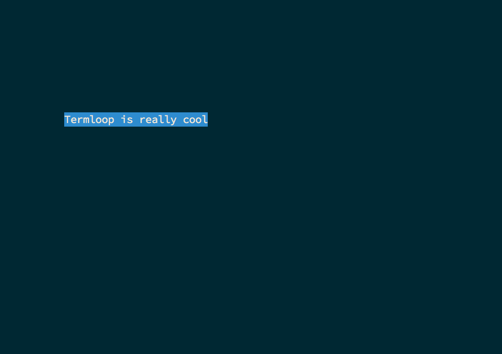
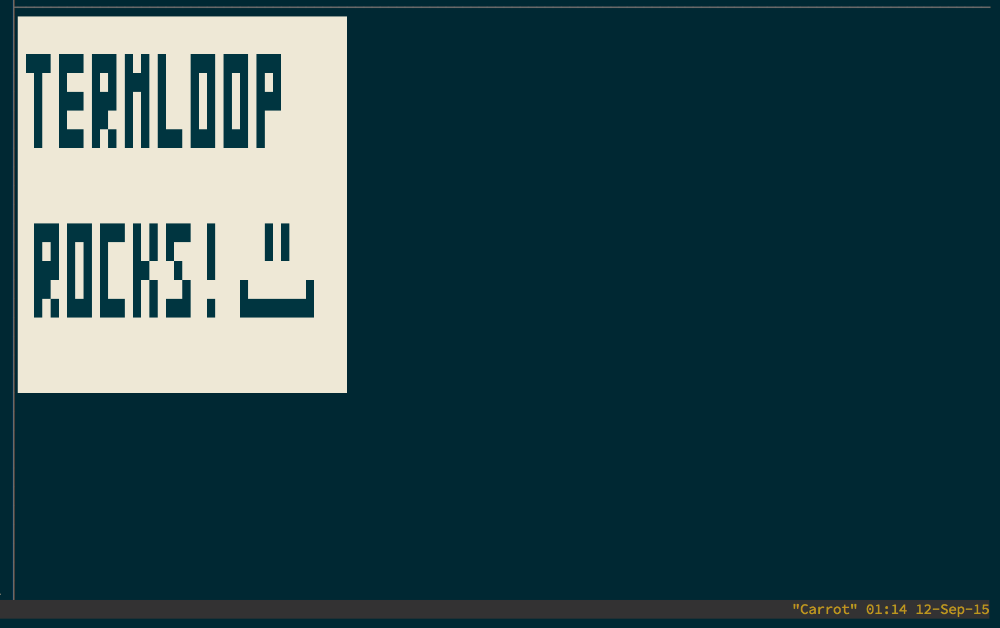
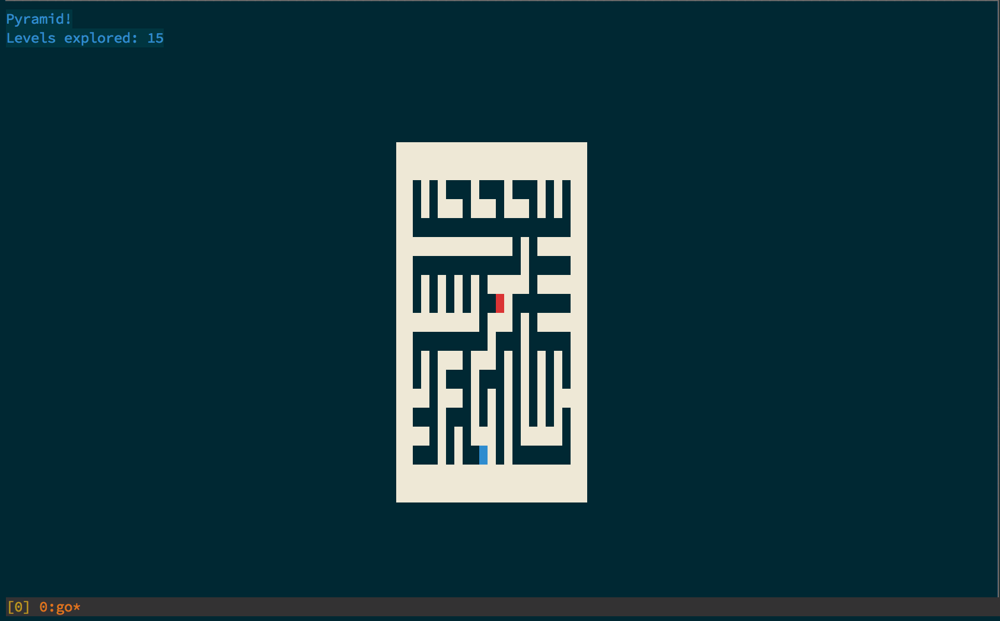
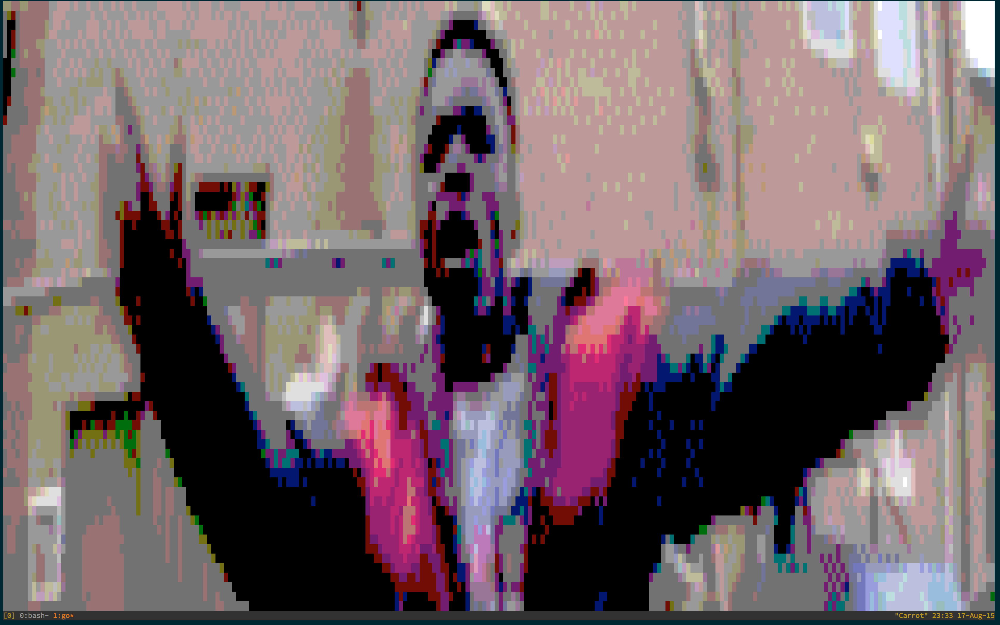
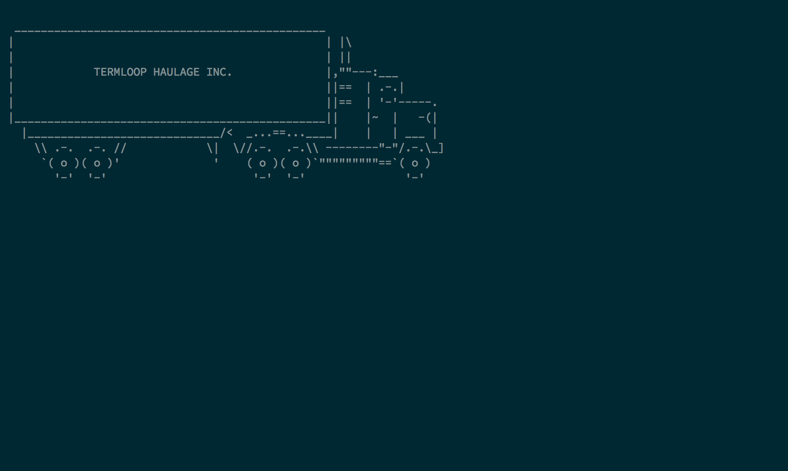
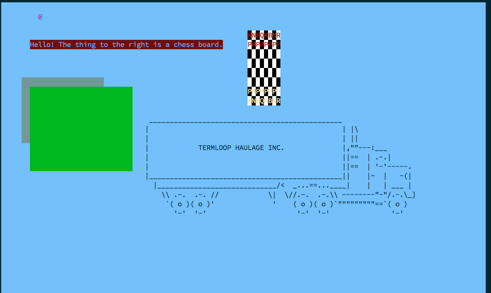
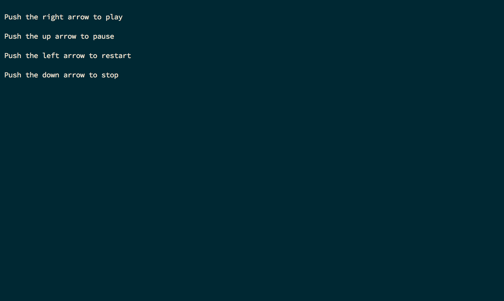

# Examples

This directory contains several small examples, which will hopefully show how to use some of Termloop's features.

## movingtext.go

This example demonstrates how to use keyboard input, as well as the Text builtin. To run, just do:

`go run movingtext.go "Some text here"`



## collision.go

This example demonstrates how to use Termloop's built in collision checking, as well as simple keyboard input. It also includes an example of an FpsText. The player's rectangle will turn blue and stop when it collides with something. To run, just do:

`go run collision.go`


## click.go

This very simple example shows how to use Termloop's mouse click detection. It's simply a grid of rectangles which change colour when you click on them - you can use it as a very primitive sort of MS Paint! You can see in the screenshot my inner child artist has come out.

To run:

`go run click.go`



## Pyramid!

You've started at the top of a pyramid - how many levels down can you get before you're helplessly lost?

This is a bit of a bigger example, showcasing Termloop's collision detection, as well as level offsets, which can be used to simulate camera movement. The mazes are all randomly generated using [Prim's algorithm](https://en.wikipedia.org/wiki/Maze_generation_algorithm#Randomized_Prim.27s_algorithm).
This example also gives a demo of how Termloop's debug logging works.

To run:

`go run pyramid.go`



## image.go

This example shows Termloop's image loading capabilities. Simply run the example with a path to an image as the first parameter, and you'll see a very simple image viewer. It can load PNG, JPEG or GIF images. Here's an example of what it looks like showing [Tempa T](http://www.youtube.com/watch?v=OZ6G7qwjom4).

This example makes use of Termloop's **pixel mode**. This splits terminal characters into two, giving double the available screen height, while sacrificing the ability to draw text.



## entityfromfile.go

This example shows Termloop's ability to generate an Entity from ASCII art provided to it as a string. This example loads the file lorry.txt, and renders its contents to the screen.

To run:

`go run entityfromfile.go`



## levelmap.go

This example demonstrates how to use Termloop's level map parser. This can read an entire level's data from a JSON string, and render it appropriately into the level. For example, the following JSON:

```json
[
    {
        "type": "Rectangle",
        "data": {
            "x": 5,
            "y": 8,
            "width": 20,
            "height": 7,
            "color": 67
        }
    },
    {
        "type": "Rectangle",
        "data": {
            "x": 7,
            "y": 9,
            "width": 25,
            "height": 9,
            "color": 35
        }
    },
    {
        "type": "Text",
        "data": {
            "x": 7,
            "y": 4,
            "text": "Hello! The thing to the right is a chess board.",
            "fg": 70,
            "bg": 53
        }
    },
    {
        "type": "Entity",
        "data": {
            "x": 35,
            "y": 12,
            "text": "lorry.txt",
            "fg": "",
            "bg": ""
        }
    },
    {
        "type": "Entity",
        "data": {
            "x": 60,
            "y": 3,
            "text": "chessboard.txt",
            "fg": "images/chesspieces.png",
            "bg": "images/chessboard.png"
        }
    },
    {
        "type": "Player",
        "data": {
            "x": 0,
            "y": 0,
            "ch": "@",
            "color": 91
        }
    }
]

```

Will render like so:



Additionally, a user may define a map of custom parsing functions, which dictate how to read a custom object, just as the Player object in the above example, from JSON and into a real entity.

To run this example, simply do:

`go run levelmap.go`

Please see the example's source code, and the map.go source code, for a more detailed explanation.

# Termloop extras examples

These examples use the termloop/extra package, which means that they have some external dependencies and may not run without some additional libraries being installed.

## audio.go

Provides a very simple audio player. Depends on PortAudio and libsndfile being installed. Supported file types are whatever is supported by libsndfile - for example, WAV and OGG are both tested to work.

To run: 

`go run audio.go [path to audio file]`


